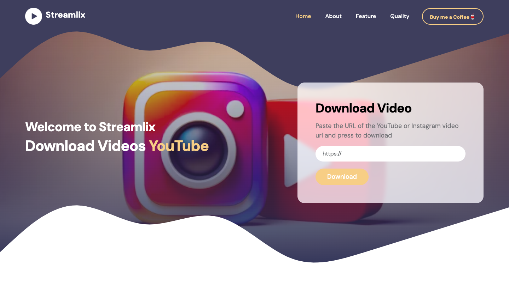
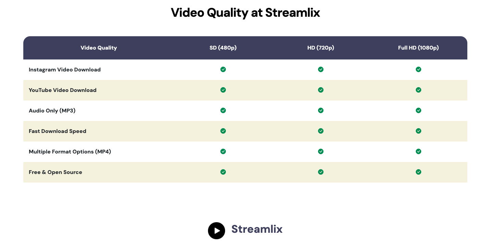
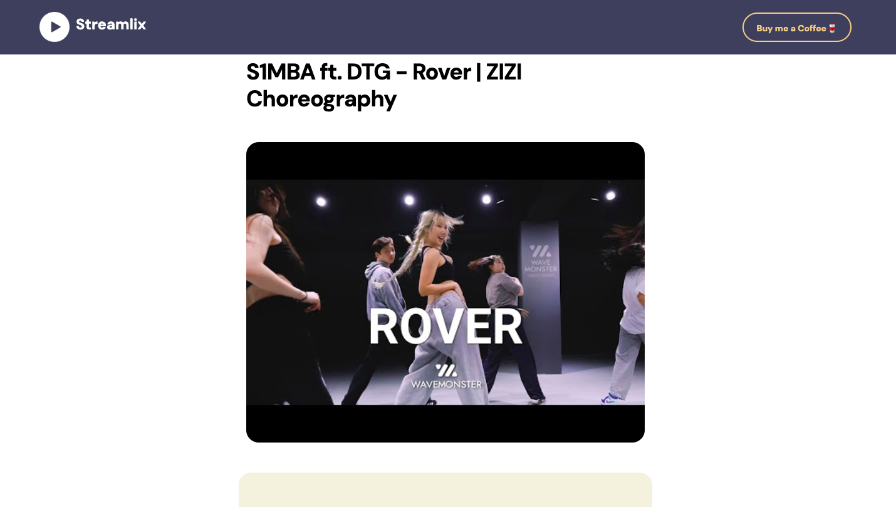
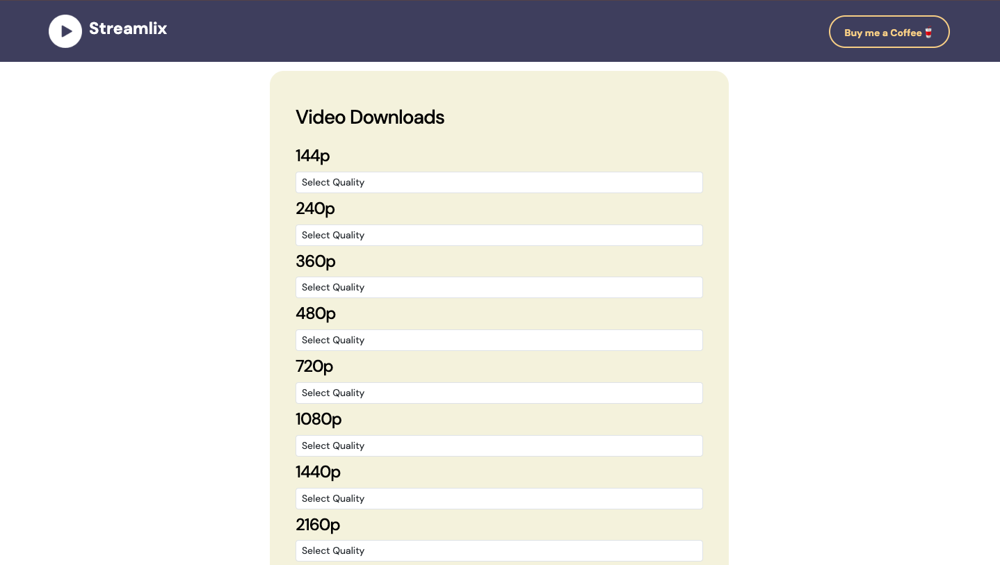

# 🎬 Streamlix

**Streamlix** is a simple and powerful web application that allows users to download videos and audio from platforms like Instagram and YouTube in high quality — completely free.

Built with a modern web stack including **Flask, HTML, CSS, JavaScript, and Bootstrap**, Streamlix offers a clean interface and fast performance for a seamless downloading experience.

---

## 📸 Screenshots






---

## 🚀 Features

* 📥 Download **YouTube videos** in high quality
* 🎵 Extract and download **audio (MP3)** from videos
* 📸 Download **Instagram videos** easily
* ⚡ Fast and lightweight performance
* 💻 Responsive UI built with Bootstrap
* 🆓 100% Free to use

---

## 🛠️ Tech Stack

* **Backend:** Flask (Python)
* **Frontend:** HTML, CSS, JavaScript
* **UI Framework:** Bootstrap

---

## 📂 Project Structure

```
streamlix/
│
├── static/              # CSS, JS, FONTS, IMAGES AND VIDEOS
├── screenshots          # SCREENSHOTS
├── templates/           # HTML templates
├── app.py               # Main Flask application
├── requirements.txt     # Dependencies
├── LICENCE              # MIT LICENCE
├── .python-version      # PYTHON VERSION
└── README.md            # Project documentation
```

---

## ⚙️ Installation & Setup

Follow these steps to run the project locally:

### 1. Clone the repository

```bash
git clone https://github.com/hunjanhar/streamlix.git
cd streamlix
```

### 2. Create a virtual environment (optional but recommended)

```bash
python -m venv venv
source venv/bin/activate   # On Mac/Linux
venv\Scripts\activate      # On Windows
```

### 3. Install dependencies

```bash
pip install -r requirements.txt
```

### 4. Run the application

```bash
python app.py
```

### 5. Open in browser

```
http://127.0.0.1:5000/
```

---

## 📸 Usage

1. Paste the video URL (YouTube or Instagram) and click on Submit
2. Choose format (Video or Audio) for **Download**
4. Enjoy your content offline 🎉

---

## ⚠️ Disclaimer

Streamlix is intended for **educational and personal use only**.
Downloading copyrighted content without permission may violate the terms of service of platforms like YouTube and Instagram. Please use responsibly.

---

## 🤝 Contributing

Contributions are welcome!
Feel free to fork the repository and submit a pull request.

---

## 📄 License

This project is licensed under the **MIT License**.

---

## 👨‍💻 Author

Developed by **Hunjan**

---

⭐ If you like this project, consider giving it a star!
