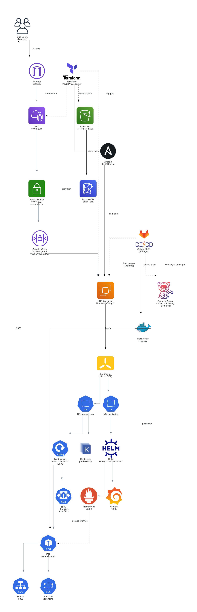
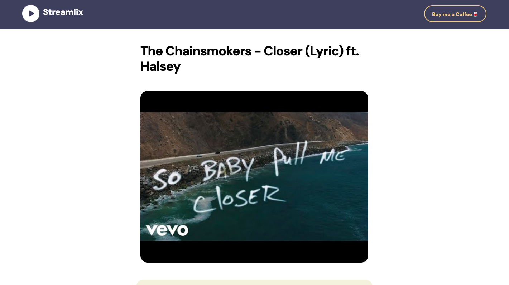
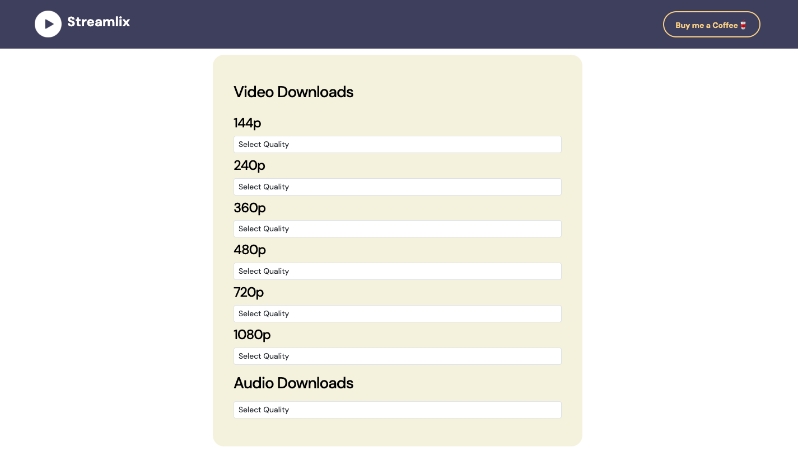

# Streamlix

> A fast, production-ready web app to download YouTube & Instagram videos, reels, and audio — deployed on AWS with a full CI/CD pipeline.

## Overview

Streamlix is a Python/Flask web application that lets users download videos, reels, and audio from **YouTube** and **Instagram** directly from their browser. It supports multiple video quality formats and audio-only extraction. The app is containerized with Docker, deployed on an AWS EC2 instance running a **K3s Kubernetes cluster** (via k3d), and ships with a complete GitLab CI/CD pipeline including security scanning and email notifications.

---

## Features

- Download YouTube videos in multiple resolutions (up to 4K)
- Download audio-only streams (MP3/M4A)
- Download Instagram Reels and posts
- Real-time download progress tracking (via background threads)
- Auto-detect video thumbnails for YouTube & Instagram
- Security hardened container (non-root user, read-only filesystem, dropped capabilities)
- Prometheus metrics endpoint (`/metrics`) with Grafana dashboards
- Auto-cleanup of downloaded temp files after 30 seconds

---

## Architecture



---

## Application





---

## Project Structure

```
streamlix/
├── app.py                   # Flask application (routes, yt-dlp logic)
├── test_app.py              # Pytest unit tests
├── requirements.txt         # Python dependencies
├── Dockerfile               # Multi-stage Docker build
├── docker-compose.yml       # Local compose setup
├── .gitlab-ci.yml           # GitLab pipeline entry point
├── .gitlab/                 # Modular CI/CD job definitions
├── k8s/
│   ├── prod/                # Production Kubernetes manifests
├── terraform/               # AWS infrastructure as code
│   └── playbooks/
│       ├── config.yml       # Ansible playbook entry point
│       └── roles/config/    # Ansible role (tasks, handlers, defaults)
├── remote-infa/             # Terraform for remote state backend
├── static/                  # CSS, JS, fonts, images
└── templates/               # Jinja2 HTML templates
```

---

## CI/CD Pipeline

The GitLab pipeline runs 5 sequential stages on every push:

```
test → security-scan → build → deploy → notify
```

| Stage | Jobs | Description |
|---|---|---|
| `test` | `test-app` | Runs `pytest` in Python 3.11 slim |
| `security-scan` | `trivy-fs-and-config` | Trivy filesystem + config scan (HTML report artifact) |
| `security-scan` | `trufflehog_scan` | Secret detection on git history (MR/main only) |
| `security-scan` | `semgrep_sast` | SAST scan with Semgrep, outputs GitLab SAST report |
| `build` | `build-app` | Docker build, saves image as artifact |
| `build` | `scan-image` | Trivy container image scan (blocks on HIGH/CRITICAL) |
| `build` | `push-app` | Pushes image to DockerHub with commit SHA tag + `latest` |
| `deploy` | `deploy-k8s` | SSH to EC2, patch image tag, `kubectl apply -k` |
| `deploy` | `start-port-forwards` | Starts port-forwards for app (5000), Grafana (3000), Prometheus (9090) |
| `notify` | `notify_success/failure` | Sends HTML email report via Gmail SMTP |

**Required GitLab CI/CD Variables:**

| Variable | Description |
|---|---|
| `DOCKERHUB_USERNAME` | DockerHub username |
| `DOCKERHUB_TOKEN` | DockerHub access token |
| `SSH_PRIVATE_KEY` | EC2 SSH private key (PEM) |
| `SERVER_IP` | EC2 public IP address |
| `USER_EMAIL` | Gmail address for notifications |
| `USER_APP_PASSWORD` | Gmail app password |
| `EMAIL` | Recipient email address |

---

## License

MIT — see [LICENCE](LICENCE) for details.
